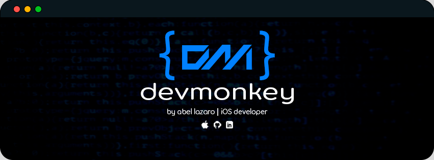

# Hi, my name is Abel Lazaro 👋
### iOS Developer

I specialize in the iOS mobile area for 4 years, and I have experience developing different projects as a developer or leader. My goal is to be an iOS & Android Software Engineer.

## 🧰 Technologies:

## 📱 Architectures:

## ⚙️ &nbsp;GitHub Analytics

 

## Find me on:

## Contact:

